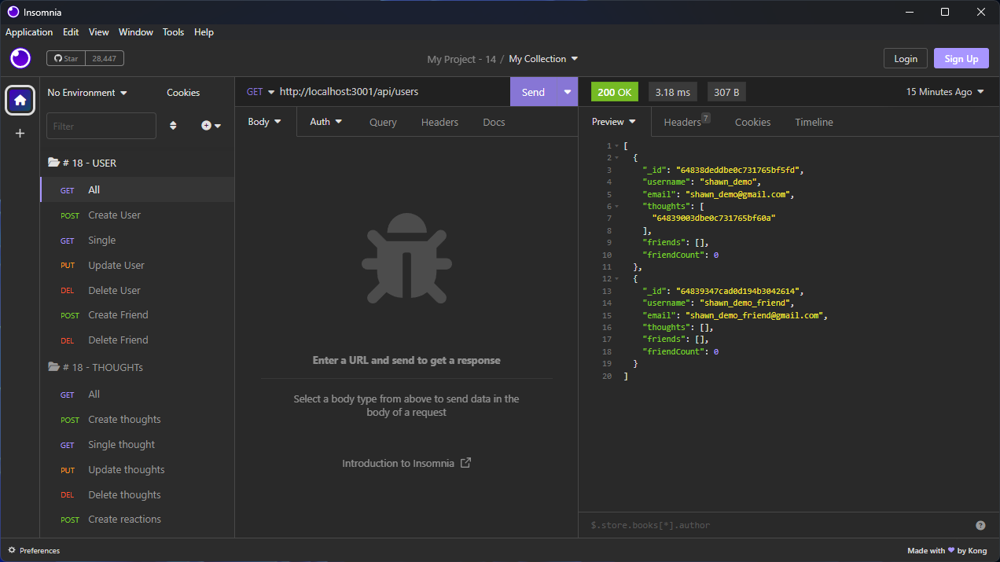
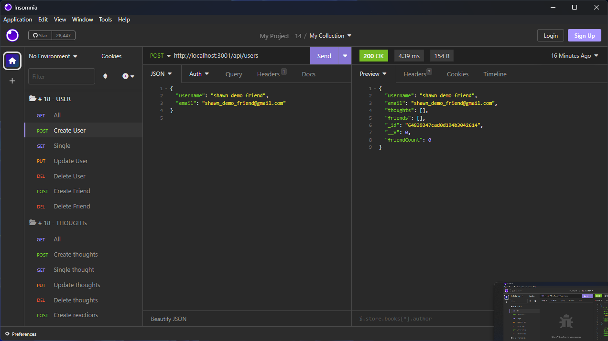
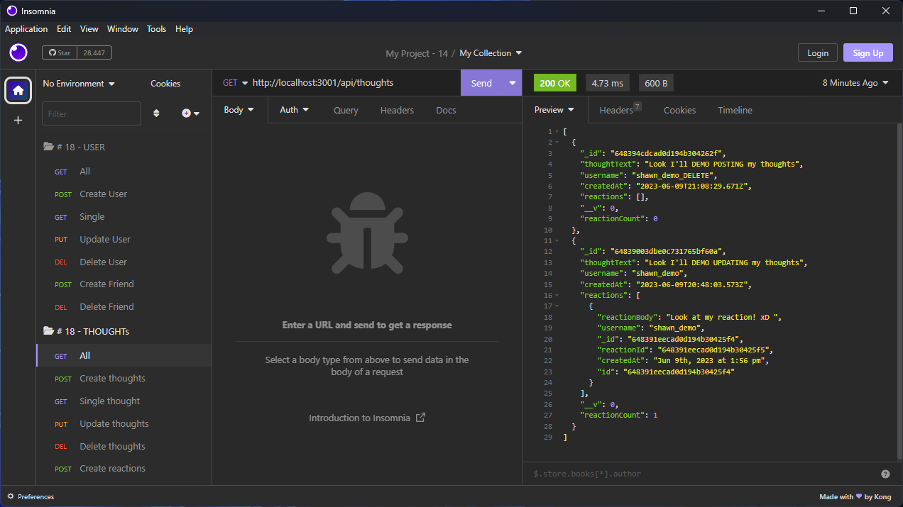
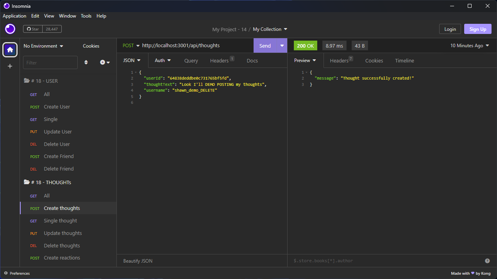

# 18 NoSQL: Social Network API

# Description

This is a social network web application API that allows users to share their thoughts, react to friends' thoughts, and manage their friend list. 
It is built using Express.js for routing, MongoDB as the NoSQL database, and Mongoose as the ODM (Object Data Modeling) tool.

The API provides various routes for interacting with users, thoughts, reactions, and friend lists. 
It supports CRUD (Create, Read, Update, Delete) operations for each of these entities, allowing users to create, retrieve, update, and delete data as needed.

      KEEP IN MIND: "If using social media is too hard, you can use email instead." SEE DETAILS BELOW.

## Features

      - User management: Create, retrieve, update, and delete users.
      - Thought management: Create, retrieve, update, and delete thoughts.
      - Reaction management: Add and remove reactions to thoughts.
      - Friend list management: Add and remove friends to a user's friend list.
      - Data validation: The API enforces data validation rules to ensure data integrity and consistency.

## Installation / Usage

      To run the social network API locally, follow these steps:

      Social Network API Installation Instructions

      1. Clone the repository:
         git clone https://github.com/lapuzshawn/social-network-api.git

      2. Navigate to the project directory:
         cd social-network-api

      3. Install the dependencies:
         npm install

      4. Set up the MongoDB database:
         - Make sure you have MongoDB installed and running on your system.

      5. Start the server:
         npm start

      6. The API should now be running locally at http://localhost:3001.

      7. Open Insomnia (or download it from https://insomnia.rest/download/ if you haven't installed it).

      8. Import the API endpoints into Insomnia
         * See thoughtRoutes.js and userRoutes.js *

      9. Test the API endpoints 
         For Example:
            - [GET] http://localhost:3001/api/users
            - [GET] http://localhost:3001/api/thoughts

      10. Explore and test other API endpoints as needed to interact with the social network web application.

## Technologies Used
    Express.js - Web application framework for handling API routing.
    MongoDB - NoSQL database for storing user, thought, and reaction data.
    Mongoose - Object Data Modeling (ODM) library for MongoDB, providing a schema-based solution for data modeling.
    JavaScript - Programming language used for implementing the API functionality.

## Video Demo

[User Demo](https://drive.google.com/file/d/1E6OYRoUZPjAYsFABABGW9NIN-iC09V0h/view?usp=sharing)

[Thoughts Demo](https://drive.google.com/file/d/1oVeeifAVy7ctOquJ70zkyfPQTOtM07Sr/view?usp=sharing)

## Screenshots

  

